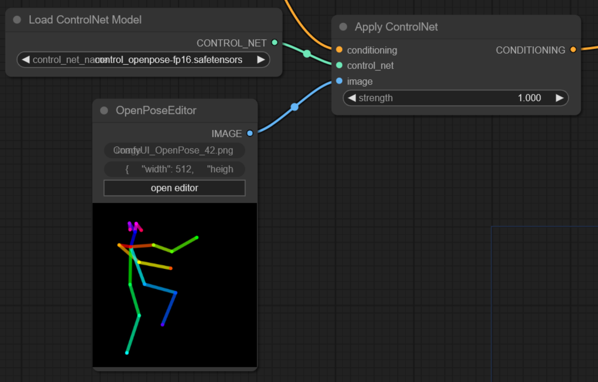
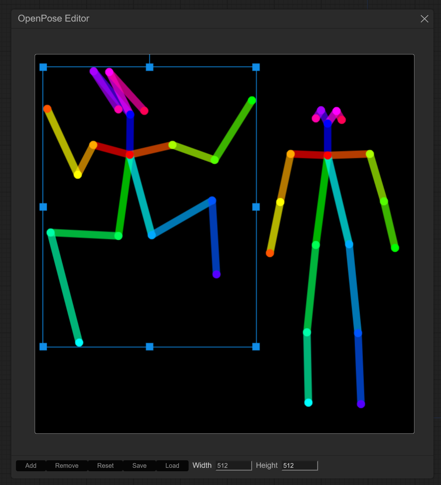

# OpenPose Editor for ComfyUI

A port of the [openpose-editor](https://github.com/fkunn1326/openpose-editor) extension for stable-diffusion-webui, now compatible with [ComfyUI](https://github.com/comfyanonymous/ComfyUI)

**NOTE**: Requires [this ComfyUI patch](https://github.com/comfyanonymous/ComfyUI/pull/711) to work correctly

## Usage

Import the `image > OpenPose Editor` node, add a new pose and use it like you would a `LoadImage` node. Each change you make to the pose will be saved to the input folder of ComfyUI.
